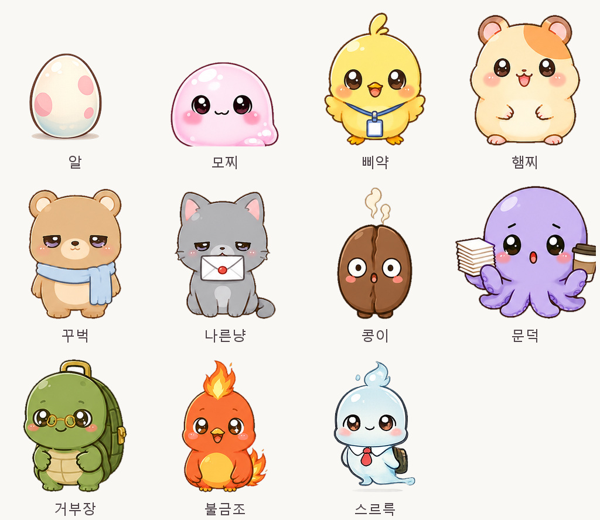

# Aegis Pet — 데스크톱 다마고치 🐣

업무시간에 윈도우 데스크톱 위에서 키우는 다마고치.
알에서 부화한 펫이 화면 하단을 자율적으로 돌아다니고, 구석에서 잠들고, 응아를 싸고,
직장인 공감 대사를 조잘대는 **투명 오버레이 데스크톱 펫**입니다.

> "일하기 싫지? 몰래 집에 가버려~" — 나른냥



## 특징

- **업무 비방해 설계**: 펫 몸체 외 전 영역 클릭 통과, 포커스 탈취 없음, 소리 기본 꺼짐
- **정통 다마고치 케어**: 배고픔·행복·청결·에너지·건강 5스탯, 방치하면 병들지만 **죽지는 않음**
- **성장 시스템**: 알 → 유아기 → 소년기(3일) → 성체(7일), 실시간 진행 + 오프라인 경과 반영
- **부화 캐릭터 10종**: 확률 + 히든 가중치 (밤에 부화하면 칼퇴 유령 '스르륵' 확률 3배!)
- **직장인 말풍선**: 요일·시간대 트리거 (월요일 위로, 오후 3시 당 떨어짐, 월급날, 야근 감지…)
- **파일 먹이기**: 안 쓰는 파일을 펫에게 드래그하면 냠냠 먹고 휴지통으로 이동 (복구 가능)

## 조작법

| 행동 | 방법 |
|------|------|
| 부화시키기 | 알 클릭 연타 (방치해도 최대 4시간이면 부화) |
| 쓰다듬기 | 펫 좌클릭 (행복 +3) |
| 케어 메뉴 | 펫 **우클릭** → 먹이/간식/놀기/청소/약/재우기 |
| 집어 옮기기 | 펫 드래그 (놓으면 낙하) |
| 응아 청소 | 응아 클릭 |
| 파일 먹이기 | 파일을 펫 위로 드래그&드롭 |
| 스탯 확인 | 트레이 아이콘 좌클릭 |
| 집중 모드 / 종료 | 트레이 아이콘 우클릭 메뉴 |

## 실행 방법

**릴리스 exe** (권장): [Releases](../../releases)에서 exe 다운로드 후 실행 (설치·관리자 권한 불필요)

**소스에서 실행**:
```bash
# Godot 4.4.1+ 필요
godot --path .            # 실행
godot --path . -- --time-scale=10   # 데모 (시간 10배속, 디버그 빌드 전용)

# 테스트
godot --headless --path . --script tests/run_tests.gd
```

## 프로젝트 문서 (PDCA)

| 문서 | 내용 |
|------|------|
| [기획서](docs/01-plan/features/desktop-tamagotchi.plan.md) | 요구사항 FR-01~20, 범위, 리스크 |
| [설계서](docs/02-design/features/desktop-tamagotchi.design.md) | 아키텍처, FSM, 저장 스키마, 테스트 계획 |
| [캐릭터 디자인](docs/02-design/characters.md) | 10종 성격·특성·팔레트·대사 전체 |

## 기술 스택

- **Godot 4.4** (GDScript) — 투명창 + `window_set_mouse_passthrough` 클릭 통과
- Autoload 싱글톤(상태/시간/저장) + State 패턴 FSM
- 스프라이트: Python(Pillow) 생성 스크립트 `tools/gen_sprites.py`
- 저장: `user://save.json` 원자적 쓰기 + 백업, 오프라인 경과 50%·8시간 캡
